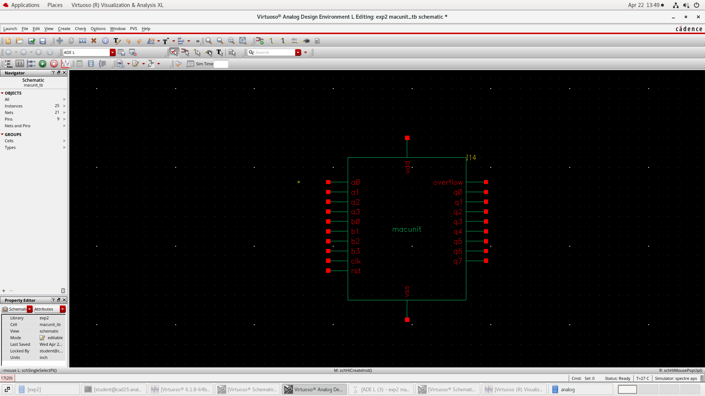
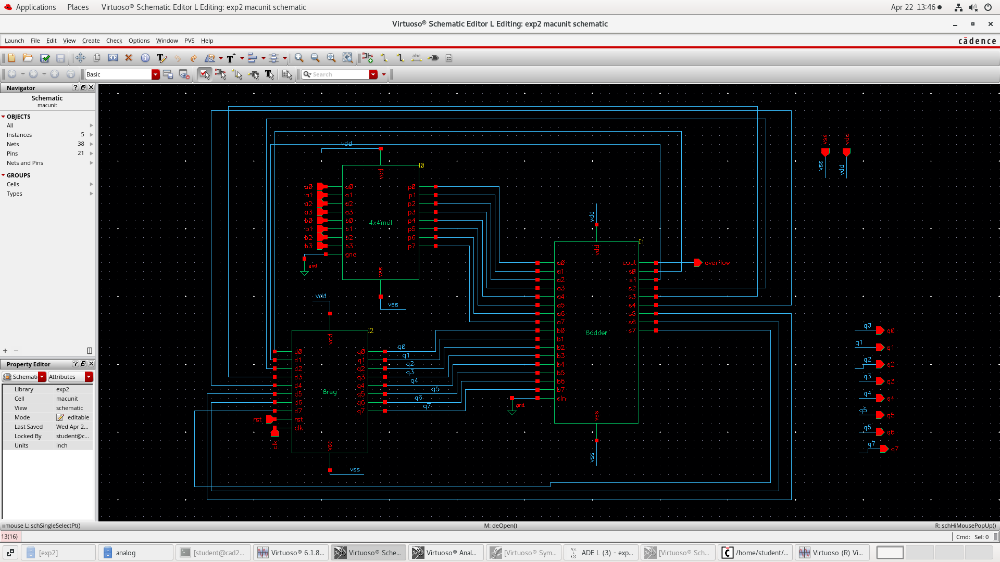
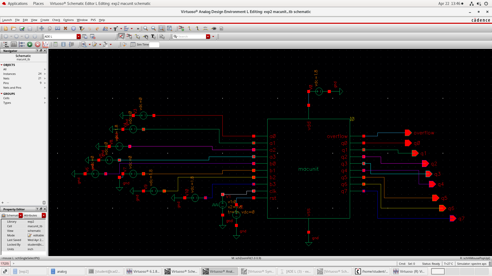
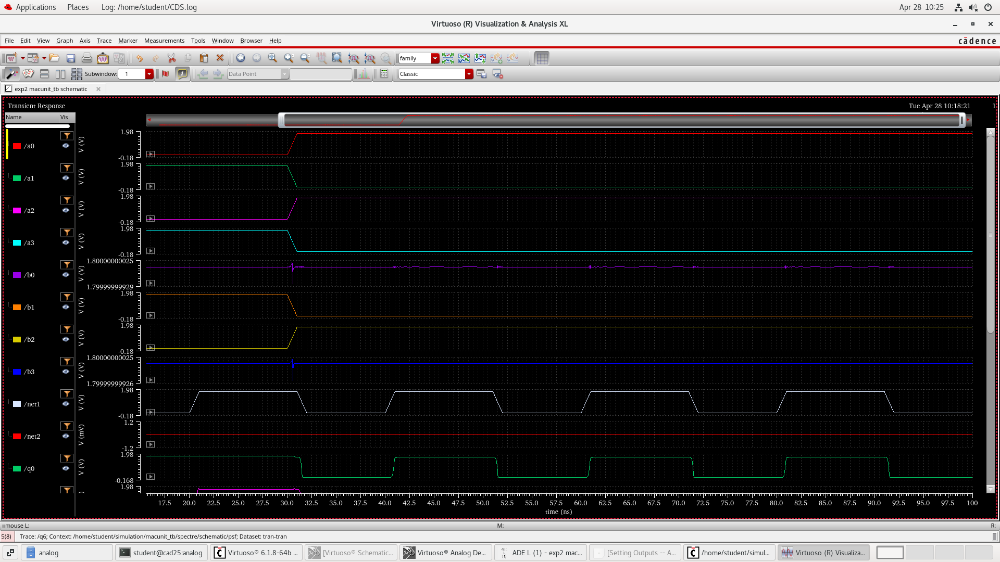
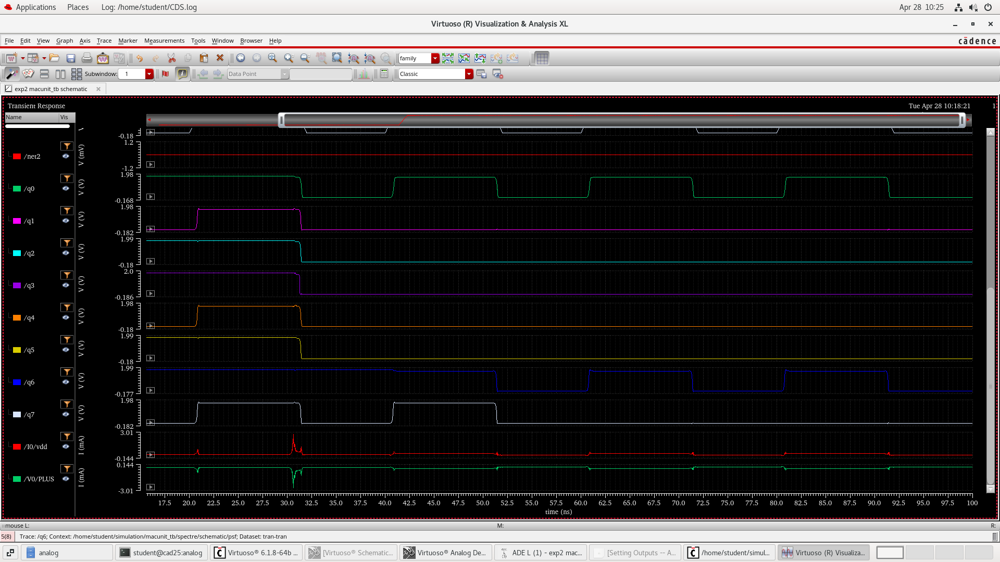
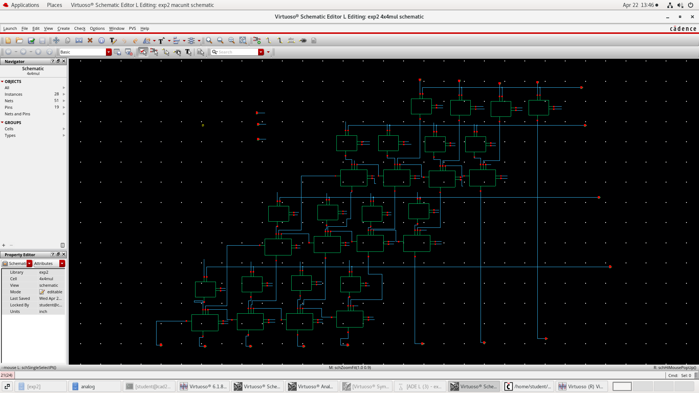
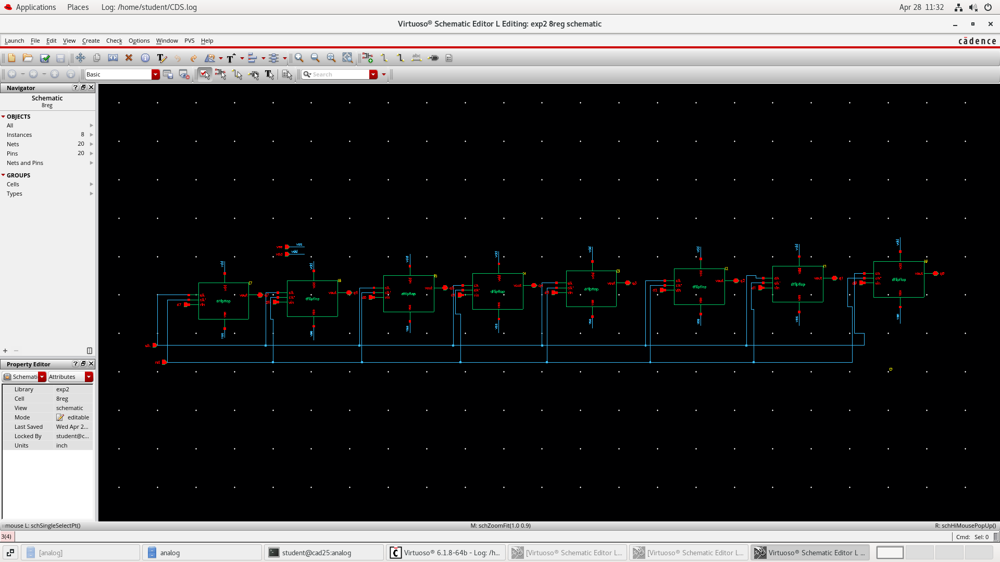
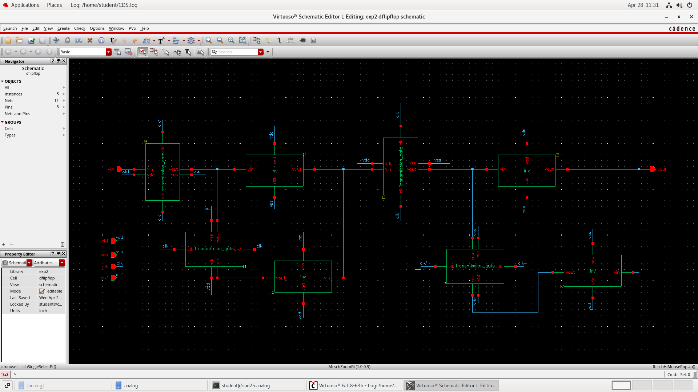
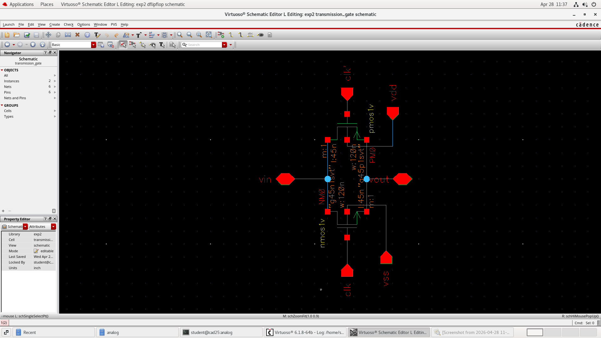

# 🔧 Analog MAC Unit Design using CMOS (Cadence Virtuoso)

> Design and simulation of a Multiplier–Accumulator (MAC) unit at transistor level using Cadence Virtuoso.

---

## 🧩 Overview
This project implements a **MAC (Multiplier and Accumulator)** using CMOS logic. It integrates arithmetic and sequential blocks to perform:
  
**Y = Σ (Ai × Bi)**

The design is validated using transient simulations and analyzed for delay and power.

---

## ⚙️ Tools & Technology
- Cadence Virtuoso (Schematic + Simulation)
- CMOS Technology

---

## 🧠 Architecture
- 4×4 Multiplier (partial products + adders)
- 8-bit Adder
- 8-bit Register
- D Flip-Flop (Transmission Gate)

---

## 🖼️ Design Implementation

### 🔹 MAC Unit Block Diagram

### 🔹 MAC Unit Schematic

### 🔹 MAC Unit Symbol

### 🔹 Output Waveforms

---

## 🔧 Building Blocks

### 🔹 4×4 Multiplier

### 🔹 8-bit Register

### 🔹 D Flip-Flop (Transmission Gate)

### 🔹 Transmission Gate

---

## 📊 Performance Results
- **Propagation Delay:** ~949 ps  
- **Average Power:** ~104 nW  

---

## 📌 Key Learnings
- Transistor-level CMOS design  
- Analog simulation (transient analysis)  
- Integration of arithmetic + sequential blocks  
- Performance evaluation (delay & power)

---

## 🚀 Future Improvements
- Layout design (DRC & LVS)  
- Power optimization techniques  
- Higher bit-width MAC implementation  

---

## 👩‍💻 Author
**Amulya S Gupta**
